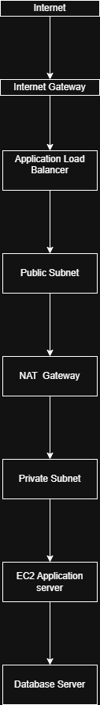

# AWS VPC Three Tier Architecture

This project demonstrates how to design a secure AWS VPC architecture for hosting a three-tier web application.
## Architecture Diagram

## Architecture Components

- VPC
- Public Subnet
- Private Subnet
- Internet Gateway
- NAT Gateway
- Route Tables
- Security Groups

## Architecture Design

Public Subnet
- Application Load Balancer
- Bastion Host

Private Subnet
- Application Servers
- Database Servers

## Key Features

- Secure network architecture
- Controlled internet access
- Separation of web, application, and database layers
- Security group configuration

## Result

This architecture provides a scalable and secure infrastructure for hosting multi-tier applications in AWS.
